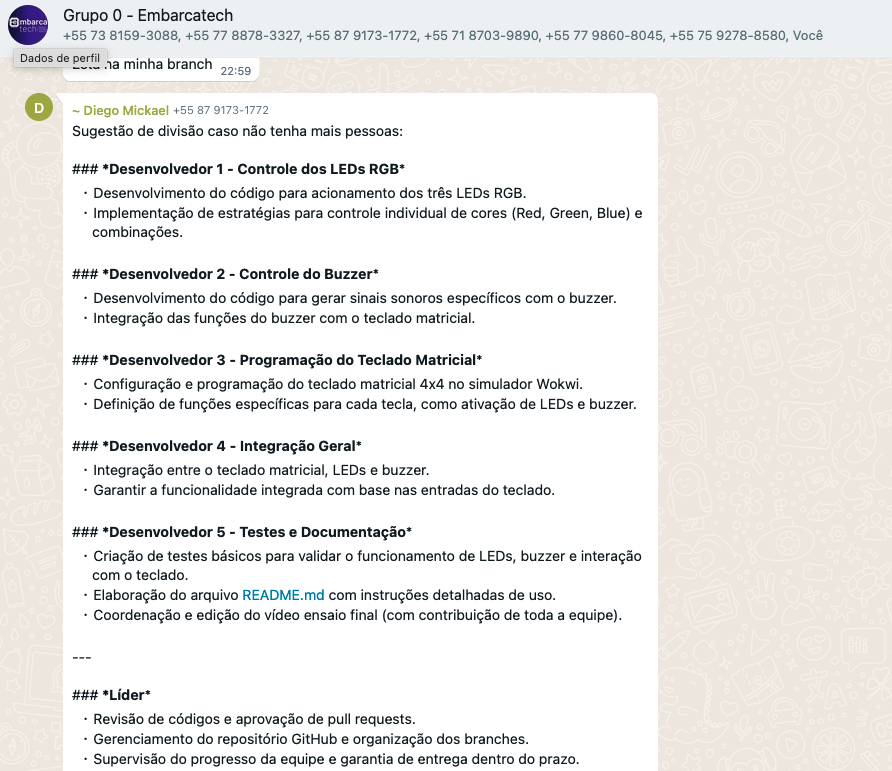
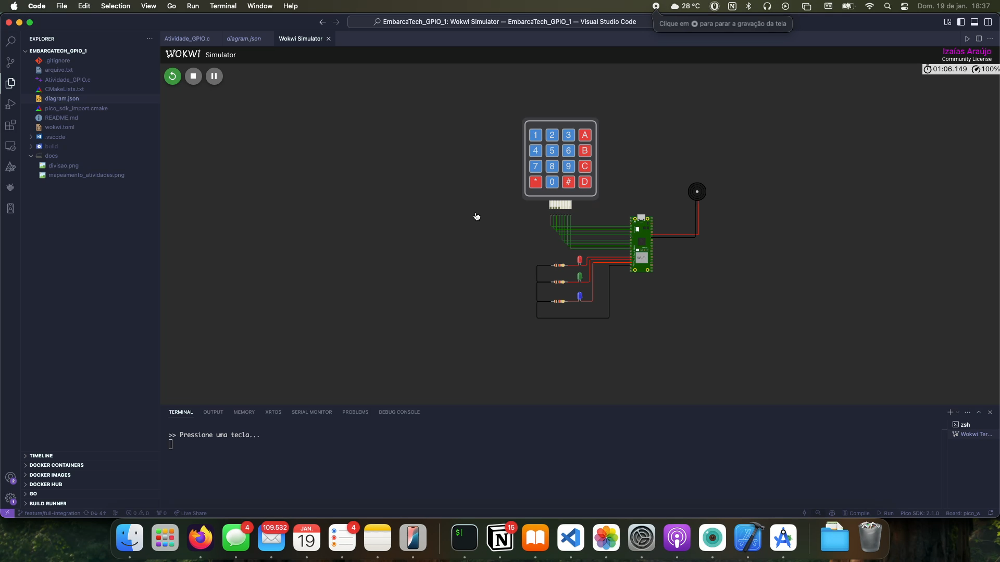

# Projeto: Teclado com Buzzer e LEDs usando Raspberry Pi Pico

## Descrição

Com o auxílio do simulador de eletrônica Wokwi, utilizou-se um teclado matricial 4x4 para controlar determinados pinos GPIO do microcontrolador RP2040, presente na placa de desenvolvimento Raspberry Pi Pico W.

Para esta atividade, realizou-se o acionamento de 03 LEDs (tipo RGB), juntamente com o controle do sinal sonoro de um buzzer.

Nesta prática, simulou-se os seguintes componentes:
1) Teclado matricial 4x4.
2) 03 LEDs – tipo RGB.
3) Componente Buzzer.
4) Microcontrolador Raspberry Pi Pico W.

Vale mencionar que as estratégias de acionamento dos LEDs e de geração do sinal elétrico do buzzer ficaram a critério da
equipe de desenvolvimento. Contudo, em caráter sugestivo, foi utilizado o vídeo com a prática de simulação associada a esta tarefa.

## Equipe

A divisão das funções foi definida pelo grupo no WhatsApp 

*Figura 1: Divisão das atividades do projeto*

*Figura 2: Definição de minha parte*

## Vídeo da Simulação

## Como Usar

1. Conecte o teclado matricial, buzzer e LEDs às portas GPIO do Raspberry Pi Pico conforme o código.
2. Compile e carregue o código no Raspberry Pi Pico.
3. Pressione as teclas no teclado para ativar as diferentes funções.

## Estrutura do Código

- **Função `initialize_gpio`**: Configura os GPIOs para o teclado, LEDs e buzzer.
- **Função `read_keypad`**: Lê a tecla pressionada no teclado matricial.
- **Funções de LEDs e Buzzer**: Executam os padrões de iluminação e som.

